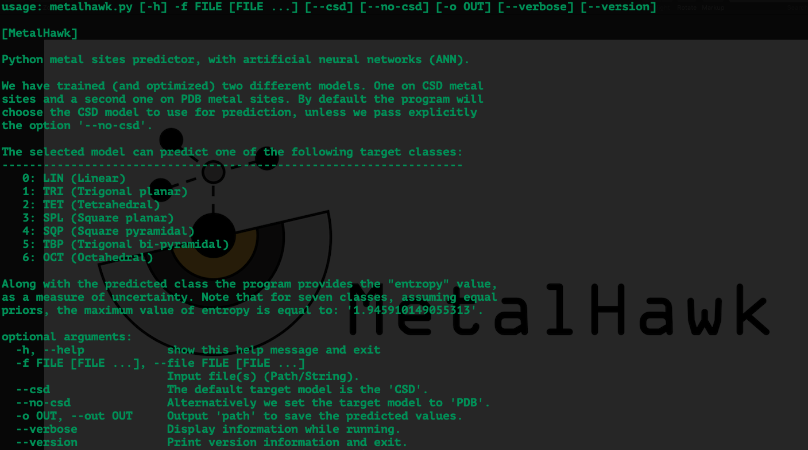

# MetalHawk

This repository provides a Python implementation of the MetalHawk program
to predict metal sites geometries.

M. Vrettas, PhD.

## Installation

There are two options to install the software.

1. The easiest way is to visit the GitHub web-page of the project and
[download the code](https://github.com/vrettasm/MetalHawk/archive/master.zip) in zip format. This option does not
require a prior installation of **git** on the computer.

2. Alternatively one can use **git** to clone the project directly as follows:
   
   `$ git clone https://github.com/vrettasm/MetalHawk.git`

## Required packages

The recommended version is **Python 3.8** (and above -- in that case you might see some warnings
due to the newer python version used). Some required packages are:

> scipy, numpy, pathlib, pandas, etc.

To ensure the required packages are installed just use:

    $ pip install -r requirements.txt

## Virtual environment (recommended)

It is highly advised to create a separate virtual environment to avoid messing with the main Python installation.
On Linux and macOS systems type:

    $ python3 -m venv metalhawk_venv

Note: "metalhawk_venv" is an _optional_ name.

Once the virtual environment is created activate it with:

    $ source metalhawk_venv/bin/activate

Make sure **pip** is updated:

    $ python3 -m pip install --upgrade pip

Then we can install all the requirements as above:

    $ pip install -r requirements.txt

or

    $ python3 -m pip install -r requirements.txt

N.B. For Windows systems follow the **equivalent** instructions.

## Data extraction (conversion)
The program as it is expecting sphere pdb/csd files as input. For a generic input file you need to pass the input
first from the 'extract_metal_sites.py'. The input of the script is a directory containing the generic 'pdb' or
'cif' files, while the output is a new directory containing the sphere 'pdb' files that can be used directly as
input for MetalHawk. This script requires "pymol-open-source=2.5.0" to run.

## How to run

To execute the program (within the activated virtual environment), you can either navigate to the main
directory of the project (i.e. where the metalhawk.py is located), or locate it through the command line
and then run the following command:

    $ ./metalhawk.py -f path/to/filename.pdb

   > **Hint**: If you want to run the program on multiple files (in the same directory)
   > you can use the '*' wildcard as follows:
   >  
   > $ ./metalhawk.py -f path/to/*.pdb

This will run MetalHawk on all the files (in the directory) with the '.pdb' extension.

Finally, if you want the output to be saved in a csv file format, use the '-o path/to/save/' option.

      $ ./metalhawk.py -f path/to/*.pdb -o /path/to/save/

This will use the "path/to/save/" and create a file with the output of the prediction. The filename is
generated automatically.

---

To explore all the options MetalHawk has to offer, type:

    $ ./metalhawk.py -h

You will see the following menu:

## References

The original work is described in detail at:

[Gianmattia Sguelia, Michail D. Vrettas, Marco Chino, Alfonso De Simone and Angela Lombardi (2023)](https://pubs.acs.org/doi/10.1021/acs.jcim.3c00873). "MetalHawk: Enhanced Classification of Metal
Coordination Geometries by Artificial Neural Networks".
Journal of Chemical Information and Modeling, DOI: 10.1021/acs.jcim.3c00873.

The MetalHawk logo (GitHub image) is designed by Gianmattia Sguelia.

## Documentation

Here you can find the [documentation](./docs/MetalHawk/index.html) of the code.

## Contact

For any questions/comments (**_regarding this code_**) please contact me at:
vrettasm@gmail.com
